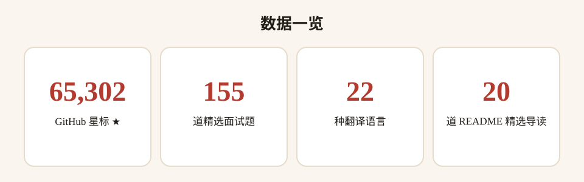
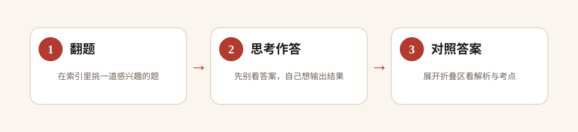

# JavaScript 面试题 · 中文版

> **全球最热门的前端刷题题库 · 中文导读版**
> 源自 GitHub 上 **65,000+ ★** 的 [lydiahallie/javascript-questions](https://github.com/lydiahallie/javascript-questions)，收录 **155 道 JavaScript 高频面试题**，每题带详细答案与解析，已被翻译成 **22 种语言**，是全球覆盖面最广的 JS 面试题库之一。


---

## 目录

- [这是什么？](#这是什么)
- [为什么值得收藏](#为什么值得收藏)
- [数据一览](#数据一览)
- [快速开始](#快速开始)
- [精选 20 题导读](#精选-20-题导读)
- [全量题目索引](#全量题目索引)
- [完整数据](#完整数据)
- [常见问题 FAQ](#常见问题-faq)
- [参与贡献](#参与贡献)
- [致谢](#致谢)
- [许可声明](#许可声明)

---

## 这是什么？

**JavaScript 面试题 · 中文版** 是对全球最热门的前端面试题库 [lydiahallie/javascript-questions](https://github.com/lydiahallie/javascript-questions) 的中文二次开发项目。

源项目以「一问一答」的形式收录了 **155 道 JavaScript 面试题**：从作用域、闭包、this 指向、事件循环，到原型链、类型转换、Promise 微任务，每题都有详细答案与解析，帮助开发者**在对话中真正理解 JS 运行机制**，而不是死记答案。源 README 顶部提供了 22 种语言的翻译链接（含简体中文与繁体中文）。

**中文版做了什么：**
- 🗂️ 把源仓 **155 道题** 全量提取为中文索引（[questions-index.md](questions-index.md)），题号 + 英文题面 + 源仓直达链接；
- ⚡ 在本 README 精选 **20 道高频题**，配中文考点导读；
- 📖 说明刷题方法（先作答、再对照答案），并注明源项目 2019 年创建、题目基于当时的 JS 语法。

## 为什么值得收藏

- 🎯 **面试高频全覆盖**：闭包、this、原型链、事件循环、类型转换……前端八股核心一网打尽；
- ✅ **每题带答案解析**：源仓每题均有详细解释，先自己想、再对照，查漏补缺；
- 🌍 **22 种语言翻译**：全球覆盖面最广的 JS 面试题库之一，中文翻译同样齐备；
- 📈 **65,000+ 星口碑**：被全球开发者反复验证的高质量刷题资源；
- 🇨🇳 **中文友好**：全量索引 + 精选导读，从选题到对照都顺畅。

## 数据一览

<p align="center">
  
</p>

> 数字来自源仓 [README.md](https://github.com/lydiahallie/javascript-questions/blob/master/README.md) 实际抓取统计（2026-10-05 核实）。

## 快速开始

### 三步刷题

<p align="center">
  
</p>

1. **翻一题**：在下方精选导读或 [全量索引](questions-index.md) 里任选一题；
2. **思考作答**：先凭自己的理解给出答案，并想想「为什么」；
3. **对照答案**：点源仓题目链接展开答案与解析，标记错题、记录盲区，面试前集中复习。

### 示例：一道经典题

第 3 题：

```javascript
const shape = {
  radius: 10,
  diameter() {
    return this.radius * 2;
  },
  perimeter: () => 2 * Math.PI * this.radius,
};

console.log(shape.diameter());  // 20
console.log(shape.perimeter()); // NaN
```

考点：`diameter()` 是普通方法，`this` 指向 shape，所以返回 20；`perimeter` 是箭头函数，箭头函数没有自己的 `this`，继承外层作用域（这里是全局），`this.radius` 为 undefined，所以返回 NaN。**对象方法 vs 箭头函数、this 绑定**，前端面试必考。

## 精选 20 题导读

| 题号 | 英文题面 | 中文考点导读 |
| --- | --- | --- |
| 1 | String addition | 字符串拼接：`1 + 2 + "3"` 从左到右计算 |
| 2 | Object property shorthand | 对象简写属性与数字键的键名顺序 |
| 3 | Method vs arrow function | 对象方法 vs 箭头函数的 this 绑定 |
| 4 | Var, let and const | var/let/const 声明提升与块级作用域 |
| 5 | Objects and primitives | 对象与原始类型的相等比较（== 与 ===） |
| 6 | Async and await | async/await 与 Promise 的返回时机 |
| 7 | Object reference and copy | 对象引用赋值与深/浅拷贝 |
| 8 | Set and array spread | Set 去重与数组展开运算符 |
| 10 | Spread and destructuring | 展开与解构的边界情况 |
| 11 | JavaScript math | JS 数学运算与位运算的隐式转换 |
| 12 | Optional chaining | 可选链 ?. 的短路与报错规则 |
| 13 | Arrays | 数组 slice/splice 的区别 |
| 14 | Console logging | console.log 与引用类型的内存态 |
| 15 | Object keys | 对象键的隐式转换（键名转字符串） |
| 16 | Assignments | 连续赋值 a = b = {} 的引用语义 |
| 22 | Immediate functions | IIFE 立即执行函数的返回与 this |
| 26 | Inheritance and polyfills | 继承与 polyfill：Array.prototype 扩展 |
| 31 | Nullish coalescing operator | 空值合并 ?? 与 || 的区别 |
| 42 | Sticky flag | 正则 y 粘性标志与全局 g 标志 |
| 77 | Temporal Dead Zone | 暂时性死区 TDZ 的经典案例 |

## 全量题目索引

📄 **[questions-index.md](questions-index.md)** — 收录源仓全部 **155 道题**：题号 + 英文题面 + 源仓题目直达链接，一页看完全部考点分布。

## 完整数据

- 📦 源仓库：[lydiahallie/javascript-questions](https://github.com/lydiahallie/javascript-questions)（默认分支 master，MIT License）
- 🌐 语言翻译列表：见源仓 README 顶部（共 22 种，含 zh-CN / zh-TW）
- 📄 源 README（英文原文）：[README.md](https://github.com/lydiahallie/javascript-questions/blob/master/README.md)

## 常见问题 FAQ

**Q1：题目有答案吗？**
有。源仓每道题下方就是答案解析，先自己作答再展开对照，效果最好。本仓索引不搬运答案正文，做题与解析都在源仓进行。

**Q2：适合什么水平的开发者？**
覆盖初中级到中高级：基础题考语法细节，进阶题考事件循环、this、原型等运行机制。建议作为面试前 1-2 周的刷题清单。

**Q3：题目会不会过时？**
源项目创建于 2019 年，部分题目基于当时的 JS 语法（如无可选链的年代）。本仓在 NOTICES 中注明时效性，建议结合 ES2023+ 语法对照学习。

**Q4：中文版和源项目什么关系？**
本仓是中文索引与导读，题目、答案、翻译都在源项目。所有题目链接均跳转源仓，版权归源作者 Lydia Hallie 及社区贡献者。

**Q5：想自己刷完 155 题要多久？**
因人而异：每天 10 题，约 2-3 周；配合面试准备，优先刷精选 20 题 + 高频考点即可。

## 参与贡献

- 🐛 发现题号或链接错误：提 Issue；
- 🌐 补充 / 修正中文导读：Fork 后修改 [questions-index.md](questions-index.md) 提 PR；
- 📝 分享你的答案理解：欢迎在 Issue 或 Discussions 交流。

## 致谢

- 感谢 [lydiahallie/javascript-questions](https://github.com/lydiahallie/javascript-questions) 作者 **Lydia Hallie** 与全体社区贡献者（[contributors](https://github.com/lydiahallie/javascript-questions/graphs/contributors)）；
- 感谢 22 种语言的全部译者，让这套题库走向全球；
- 感谢每一位认真刷题、认真理解 JS 的你 🌟

## 许可声明

- 本仓库代码与文档：**MIT License**（见 [LICENSE](LICENSE)，Copyright (c) 2026 zieang88888）；
- 源项目 [lydiahallie/javascript-questions](https://github.com/lydiahallie/javascript-questions)：**MIT License**；
- 第三方声明与完整署名见 [THIRD_PARTY_NOTICES.md](THIRD_PARTY_NOTICES.md)。
