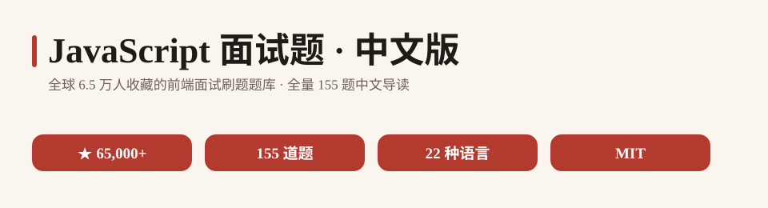

<p align="center">
  
</p>

# JavaScript 面试题 · 中文版

> **全球最受欢迎的 JavaScript 自测题库 · 中文导读版**
> 源自 GitHub 上 **65,000+ ★** 的 [lydiahallie/javascript-questions](https://github.com/lydiahallie/javascript-questions)，收录 **155 道由浅入深的 JavaScript 面试题**，覆盖变量提升、闭包、this、事件循环、原型链、异步等核心考点，答案折叠展开即可看解析，是前端面试备战与查漏补缺的刷题神器。


---

## 目录

- [这是什么？](#这是什么)
- [为什么值得收藏](#为什么值得收藏)
- [数据一览](#数据一览)
- [快速开始](#快速开始)
- [分类清单](#分类清单)
- [全量题目索引](#全量题目索引)
- [完整数据](#完整数据)
- [常见问题 FAQ](#常见问题-faq)
- [参与贡献](#参与贡献)
- [致谢](#致谢)
- [许可声明](#许可声明)

---

## 这是什么？

**JavaScript 面试题 · 中文版** 是对全球明星题库 [lydiahallie/javascript-questions](https://github.com/lydiahallie/javascript-questions) 的中文二次开发项目。

源项目由 Lydia Hallie 创建于 **2019 年**，以「看代码 → 猜输出 → 展开答案对照」的形式，收集了 **155 道从基础到进阶的 JavaScript 自测题**：变量提升与暂时性死区、闭包与事件循环、箭头函数 this、原型链与继承、`==` 与 `===` 隐式类型转换、对象引用、数组方法、ES6+ 模块化……几乎把前端面试里最容易翻车的坑全部串了一遍。每道题都有选择题 + 折叠答案区，点开即看深入浅出的解析。

**中文版做了什么：**
- 🗂️ 把源仓 **155 道题** 全量提取为中文索引（[questions-index.md](questions-index.md)），题号 + 英文原题 + 直达源 README 锚点链接，点开即做题；
- ⚡ 在本 README 精选 **20 道高频面试题**，配中文译名 + 一句话考点；
- 📖 提炼「三步刷题法」与 FAQ，让你从零开始高效刷完这套题库。

## 为什么值得收藏

- 🧠 **面试高频全覆盖**：变量提升、闭包、this 指向、事件循环、原型链、`==`/`===`、箭头函数、let/const/var、setTimeout 异步、对象引用——面试官最爱问的点这里全有；
- 🎯 **猜输出式刷题**：先看代码自己猜结果，再展开折叠答案对照，比看教程记忆深刻十倍；
- 📚 **由浅入深**：155 题从基础语法一路铺到 ES6 模块化与纯函数，梯度自然，越刷越上头；
- 🌍 **22 种语言社区**：源仓已被翻译成简体中文、繁体中文等 22 种语言，全球前端开发者都在用；
- 🇨🇳 **中文友好**：全量索引 + 精选译名 + 上手指引，英文题面也不再劝退。

## 数据一览

<p align="center">
  
</p>

> 数字全部来自源仓 [README.md](https://github.com/lydiahallie/javascript-questions/blob/master/README.md) 实际统计（星数为 GitHub 实测，题目数按六级标题 `###### N.` 计数，2026-10-05 核实）。

## 快速开始

### 三步上手

<p align="center">
  
</p>

1. **翻题**：在下方精选清单或 [全量索引](questions-index.md) 中挑一道题——新手建议从第 1 题（变量提升）开始；
2. **思考作答**：先别看答案，在脑子里（或浏览器控制台）跑一遍代码，选出你认为正确的选项；
3. **对照答案**：点开题目下方的折叠答案区，对照解析搞清「为什么对、为什么错」，把坑记下来。

### 示例：第 1 题 · 变量提升与暂时性死区

```javascript
function sayHi() {
  console.log(name);
  console.log(age);
  var name = 'Lydia';
  let age = 21;
}

sayHi();
```

`var name` 会被提升并默认初始化为 `undefined`，所以第一行打印 `undefined`；而 `let age` 虽然也被提升，但**不会被初始化**，在声明之前访问会直接抛出 `ReferenceError`——这就是「暂时性死区」。答案：**D**。

### 示例：第 2 题 · setTimeout 与块级作用域

```javascript
for (var i = 0; i < 3; i++) {
  setTimeout(() => console.log(i), 1);
}
for (let i = 0; i < 3; i++) {
  setTimeout(() => console.log(i), 1);
}
```

第一个循环里 `i` 是 `var`（全局共享），等宏任务执行时 `i` 已经变成 `3`，打印 `3 3 3`；第二个循环里 `i` 是 `let`（每轮块级绑定），每次回调闭包拿到当轮的 `i`，打印 `0 1 2`。答案：**C**。

> 更多题目与题解入口，见 [questions-index.md](questions-index.md)。

## 分类清单

精选 **20 道高频面试题**（完整 155 道见 [questions-index.md](questions-index.md)）：

| 题号 | 英文题目标题 | 中文译名 | 一句话考点 |
| --- | --- | --- | --- |
| 1 | What's the output? | 变量提升与暂时性死区 | `var` 提升为 `undefined`，`let/const` 进入 TDZ |
| 2 | What's the output? | setTimeout 与 var/let | `var` 全局共享打印 3，`let` 块级绑定打印 0 1 2 |
| 3 | What's the output? | 箭头函数的 this | 箭头函数 this 继承外层，`this.radius` 为 undefined → NaN |
| 4 | What's the output? | 一元加号与真值 | `+true` 转 1，对真值取 `!` 得 false |
| 5 | Which one is true? | 点号与方括号取值 | 对象键都是字符串，点号不解析变量 |
| 6 | What's the output? | 对象引用赋值 | 对象按引用传递，改 `c` 会影响 `d` |
| 7 | What's the output? | `==` 与 `===` 包装对象 | `new Number()` 是对象，`==` 比值 `===` 比类型 |
| 8 | What's the output? | static 静态方法 | 静态方法挂在构造函数上，实例调用报错 |
| 10 | What happens when we do this? | 函数也是对象 | 函数可像普通对象一样挂载自定义属性 |
| 11 | What's the output? | 构造函数方法 vs prototype | 直接挂构造函数上，实例访问不到 |
| 12 | What's the output? | 不用 new 调用构造函数 | `this` 指向全局，返回值 `undefined` |
| 13 | What are the three phases of event propagation? | 事件传播三阶段 | 捕获 → 目标 → 冒泡 |
| 14 | All object have prototypes. | 原型链 | 并非所有对象都有原型（基础对象原型为 null） |
| 15 | What's the output? | 隐式类型转换 | `1 + '2'` 触发字符串拼接得到 `"12"` |
| 16 | What's the output? | 前置/后置 ++ | 后置先返回后自增，前置先自增后返回 |
| 22 | How long is cool_secret accessible? | sessionStorage 生命周期 | 关闭标签页即清除，关浏览器不影响 |
| 26 | The global execution context creates two things... | 全局执行上下文 | 创建全局对象与 `this` 两个东西 |
| 31 | What is the event.target when clicking the button? | event.target | 指向触发事件的最内层元素（button） |
| 42 | What does the setInterval method return... | 定时器返回值 | 返回唯一 id，用于 `clearInterval` |
| 77 | Is this a pure function? | 纯函数判定 | 相同输入必得相同输出且无副作用 |

## 全量题目索引

📄 **[questions-index.md](questions-index.md)** — 收录源仓全部 **155 道题**：题号 + 英文题目标题 + 源 README 锚点直达链接，按源仓顺序 1–155 排列，点开即做题、展开即看解析。

## 完整数据

- 📦 源仓库：[lydiahallie/javascript-questions](https://github.com/lydiahallie/javascript-questions)（默认分支 `master`，MIT License）
- 👤 作者：Lydia Hallie（[博客](https://www.lydiahallie.io/) / [Twitter](https://www.twitter.com/lydiahallie)）
- 🌐 官方翻译：源仓已提供简体中文、繁体中文等 **22 种语言**版本
- 📄 源 README（英文原文）：[README.md](https://github.com/lydiahallie/javascript-questions/blob/master/README.md)

## 常见问题 FAQ

**Q1：我 JavaScript 基础一般，能刷吗？**
可以。题目由浅入深，前 20 题覆盖变量提升、`==`/`===`、对象引用等基础高频点，配合 [MDN Web Docs](https://developer.mozilla.org/zh-CN/docs/Web/JavaScript) 边刷边查即可；后半部分再啃闭包、原型链与 ES6+。

**Q2：题目答案在哪里看？**
源仓每道题下方都有一个折叠的 `<details><summary>Answer</summary>` 区域，点击即可展开答案与详细解析。本索引的「查看题目」链接直接跳到对应题目的锚点。

**Q3：这些题还跟得上现在的 JS 标准吗？**
源项目 2019 年创建，题目基于当时的 JavaScript 语法与行为（源 README 顶部有明确说明）。像 `var` 提升、`this`、闭包、原型链这类核心机制至今没变，仍是面试重点；但部分新语法（如顶层 `await`、ES2022+ 特性）未覆盖，建议搭配新版资料学习。

**Q4：为什么很多题目标题都叫 "What's the output?"？**
因为这套题库的核心玩法就是「给你一段代码，猜它的输出」，所以大量题目同名。题目靠**题号**区分，本索引已按题号 1–155 全量编号并直达对应锚点。

**Q5：这个中文版和源项目是什么关系？**
本项目是中文**索引与导读**，题目、答案、解析都在源项目。所有题目链接均跳转源仓，版权归源项目及贡献者所有。

## 参与贡献

- 🐛 发现译名或链接错误：提 Issue；
- 🌐 补充 / 修正中文译名：Fork 后修改 [questions-index.md](questions-index.md) 提 PR；
- 📝 分享你的刷题笔记与踩坑经验：欢迎在 Issue 交流。

## 致谢

- 感谢 [Lydia Hallie](https://github.com/lydiahallie) 创作并长期维护这套风靡全球的 JavaScript 面试题库（[contributors](https://github.com/lydiahallie/javascript-questions/graphs/contributors)）；
- 感谢把它翻译成 22 种语言的全球社区译者；
- 感谢每一位正在刷题备战面试的你 🌟

## 许可声明

- 本仓库代码与文档：**MIT License**（见 [LICENSE](LICENSE)，Copyright (c) 2026 zieang88888）；
- 源项目 [lydiahallie/javascript-questions](https://github.com/lydiahallie/javascript-questions)：**MIT License**（Copyright (c) 2019 Lydia Hallie）；
- 第三方声明与完整署名见 [THIRD_PARTY_NOTICES.md](THIRD_PARTY_NOTICES.md)。
